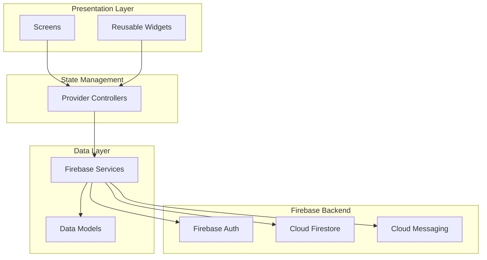
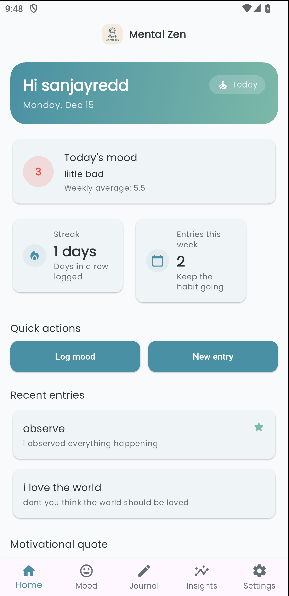

# Mental Zen

Mental Zen is a **private, secure mental wellness journal** with mood tracking, journaling, insights, and gentle reminders. It is built as a cross‑platform Flutter app (Android, iOS, web, desktop) powered by Firebase.

> GitHub repository: [sannzay/mental-zen](https://github.com/sannzay/mental-zen/tree/main)

## Table of Contents

- [Features](#features)
- [Architecture](#architecture)
- [Tech Stack](#tech-stack)
- [App Preview](#app-preview)
- [Project Structure](#project-structure)
- [Getting Started](#getting-started)
  - [Prerequisites](#prerequisites)
  - [Clone & Install](#clone--install)
  - [Firebase Setup](#firebase-setup)
  - [Run the App](#run-the-app)
- [Core Screens & Flows](#core-screens--flows)
- [State Management & Data Layer](#state-management--data-layer)
- [Testing](#testing)
- [Roadmap](#roadmap)
- [Team](#team)
- [License](#license)

## Features

- **Secure journaling**
  - Create, edit, favorite, and delete rich text journal entries.
  - Tag entries and search by title/content, tags, favorites, and recency.

- **Mood tracking**
  - Daily mood slider (1–10) with emoji and gradient feedback.
  - Quick mood logging from Home.
  - Mood history with filtering and weekly average stats.

- **Insights & analytics**
  - Trend chart of mood over time using `fl_chart`.
  - Distribution of mood ranges (low / medium / high).
  - Streaks, best day of week, and journaling activity.

- **Mindfulness tools**
  - Breathing exercises with animated breathing circle and configurable patterns.
  - Daily wellness tips & motivational quotes (static content in `config/constants.dart`).

- **Wellness reminders**
  - Local notifications powered by `flutter_local_notifications`.
  - Create, enable/disable, edit, and delete reminders with day‑of‑week schedules.

- **Personalization & theming**
  - Ocean / nature inspired light theme with Poppins typography.
  - Optional dark mode persisted via `SharedPreferences`.

- **Authentication & security**
  - Email/password sign up & sign in with `firebase_auth`.
  - Password reset via email.
  - Per‑user Firestore security rules so users can only access their own data.

## Architecture

The app follows a **layered architecture** described in [`plan.md`](./plan.md):



- **Presentation**: Flutter screens and reusable widgets under `lib/screens` and `lib/widgets`.
- **State**: `ChangeNotifier` providers (`auth_provider.dart`, `mood_provider.dart`, etc.) exposed via `MultiProvider` in `lib/main.dart`.
- **Data**: Firebase‑backed services (`auth_service.dart`, `firestore_service.dart`, `notification_service.dart`) and strongly typed models under `lib/models`.

## Tech Stack

- **Framework**: Flutter (Dart)
- **State management**: `provider`
- **Backend**: Firebase
  - `firebase_auth` – email/password auth
  - `cloud_firestore` – user, mood, journal, reminder documents
  - `firebase_core` – Firebase bootstrap
- **Local storage**: `shared_preferences` via `CacheService`
- **Notifications**: `flutter_local_notifications`
- **Charts & UI**: `fl_chart`, `google_fonts`

See the full dependency list in [`pubspec.yaml`](./pubspec.yaml).

## App Preview

### Screenshots

Experience Mental Zen through these screenshots showcasing the app's clean, modern interface and core features.

#### 🏠 Home Dashboard

<div align="center">
  
  <p><em>Personalized greeting with gradient hero card, today's mood card, quick stats (streak & weekly entries), and one-tap actions for logging mood or creating journal entries</em></p>
</div>

---

#### 😊 Mood Tracking

<div align="center">
  <table>
    <tr>
      <td align="center" width="50%">
        
        <p><strong>Add Mood</strong><br/><em>Log your daily mood with an intuitive slider (1-10), add optional notes, and see instant visual feedback</em></p>
      </td>
      <td align="center" width="50%">
        
        <p><strong>Mood History</strong><br/><em>Browse your mood entries chronologically, view weekly averages, and track your emotional patterns</em></p>
      </td>
    </tr>
  </table>
</div>

---

#### 📝 Journal

<div align="center">
  <table>
    <tr>
      <td align="center" width="50%">
        
        <p><strong>Journal Entries</strong><br/><em>Browse all your reflections with filters (all/favorites/recent), search functionality, and quick access to entries</em></p>
      </td>
      <td align="center" width="50%">
        
        <p><strong>Create Entry</strong><br/><em>Write rich journal entries with titles, content, tags, and mark favorites for easy access later</em></p>
      </td>
    </tr>
  </table>
</div>

---

#### 📊 Insights & Analytics

<div align="center">
  
  <p><em>Visualize your wellness journey with interactive charts showing mood trends over time, distribution analysis, streaks, and journaling activity statistics</em></p>
</div>

---

#### 🧘 Mindfulness & Wellness

<div align="center">
  
  <p><em>Access guided breathing exercises with animated visual feedback, daily wellness tips, and motivational quotes to support your mental wellness journey</em></p>
</div>

### Demo Video

> **Demo video (placeholder)**  
> A demo walkthrough video of Mental Zen will be added here.
>
> - YouTube: _`[VIDEO_URL_HERE]`_
> - File: _`/demo/mental-zen-demo.mp4` (to be added)_

## Project Structure

Based on the plan in [`plan.md`](./plan.md):

```text
lib/
  main.dart
  config/
    theme.dart         # Ocean/nature UI theme, typography
    routes.dart        # Named routes + auth-guarded navigation
    constants.dart     # Breathing patterns, wellness tips, quotes, mood text
  models/
    user_model.dart
    mood_entry.dart
    journal_entry.dart
    reminder.dart
  services/
    auth_service.dart          # Firebase Auth wrapper
    firestore_service.dart     # Firestore CRUD + streams
    notification_service.dart  # Local notifications
    cache_service.dart         # SharedPreferences wrapper
  providers/
    auth_provider.dart
    mood_provider.dart
    journal_provider.dart
    reminder_provider.dart
    insights_provider.dart
    theme_provider.dart
  screens/
    auth/          # Login, register, forgot password
    home/          # Dashboard
    mood/          # Mood main/add/history
    journal/       # Journal main/add/detail
    insights/
    mindfulness/
    reminders/
    settings/
    main_navigation.dart
  widgets/
    buttons/
    cards/
    inputs/
    common/
```

## Getting Started

### Prerequisites

- Flutter SDK (3.9.0 or later) installed and on your PATH  
  See Flutter docs: <https://docs.flutter.dev/get-started/install>
- A Firebase project (this repo is configured for `mental-zen-dev`).
- Android Studio or VS Code with Flutter extensions.

### Clone & Install

```bash
git clone https://github.com/sannzay/mental-zen.git
cd mental-zen
flutter pub get
```

### Firebase Setup

This repo is already configured via [FlutterFire CLI](https://firebase.google.com/docs/flutter/setup):

- `firebase.json` – FlutterFire configuration
- `android/app/google-services.json` – Android config
- `ios/Runner/GoogleService-Info.plist` – iOS config
- `lib/firebase_options.dart` – generated `DefaultFirebaseOptions`

If you want to point to **your own Firebase project**:

1. Install FlutterFire CLI and log in.
2. Run:

   ```bash
   flutterfire configure
   ```

3. Replace the generated files (`firebase.json`, `google-services.json`, `GoogleService-Info.plist`, `lib/firebase_options.dart`) with your project’s versions.

> Note: Currently `main.dart` initializes Firebase using `Firebase.initializeApp()` (default options from native files). You can optionally switch to `DefaultFirebaseOptions.currentPlatform` from `firebase_options.dart` if you prefer Dart‑side configuration.

### Run the App

#### Android

```bash
flutter run -d android
```

#### iOS

```bash
cd ios
pod install
cd ..
flutter run -d ios
```

#### Web (experimental)

```bash
flutter run -d chrome
```

## Core Screens & Flows

- **Auth** (`lib/screens/auth/`)
  - Email/password login, registration with confirm password, and password reset.
  - `AuthProvider` wraps `AuthService` and exposes `isLoading` and `errorMessage` for UI.

- **Home** (`lib/screens/home/home_screen.dart`)
  - “Hi {name}” greeting, date, today’s mood card, quick actions, recent journals, motivational quote.

- **Mood** (`lib/screens/mood/`)
  - `MoodScreen`, `AddMoodScreen`, `MoodHistoryScreen` with quick mood slider and real‑time list.

- **Journal** (`lib/screens/journal/`)
  - Create/edit/read journal entries, filters (all/favorites/recent), search, tags.

- **Insights** (`lib/screens/insights/insights_screen.dart`)
  - Charts and statistics computed by `InsightsProvider` over `MoodProvider` + `JournalProvider` data.

- **Mindfulness** (`lib/screens/mindfulness/`)
  - `MindfulnessScreen`, `BreathingExerciseScreen`, `TipsScreen` driven by `config/constants.dart`.

- **Reminders** (`lib/screens/reminders/`)
  - Reminder list and add/edit screen; integrates with `NotificationService` and Firestore.

## State Management & Data Layer

- **Providers** are wired in `main.dart` using `MultiProvider`:
  - `AuthProvider` (depends on `AuthService`, `FirestoreService`)
  - `MoodProvider`, `JournalProvider`, `ReminderProvider` (depend on auth + Firestore)
  - `InsightsProvider` (derives analytics from mood/journal providers)
  - `ThemeProvider` (wraps `CacheService` for dark mode persistence)

- **Firestore structure** (see [`firestore.rules`](./firestore.rules)):

```text
users/{userId}
  mood_entries/{entryId}
  journal_entries/{entryId}
  reminders/{reminderId}
```

Each provider ensures `userId` on documents matches the authenticated `uid`, satisfying the security rules.

## Testing

Tests live under [`test/`](./test):

- **Unit tests** (`test/unit/`)
  - `user_model_test.dart`
  - `mood_entry_test.dart`
  - `journal_entry_test.dart`

- **Widget tests** (`test/widget/`)
  - `zen_button_test.dart` – button label, tap, and loading state
  - `zen_slider_test.dart` – slider value changes within 1–10
  - `mood_card_test.dart` – displays mood data and responds to tap
  - `journal_card_test.dart` – displays entry data and favorite icon

Run all tests with:

```bash
flutter test
```

## Roadmap

High‑level stages are documented in [`plan.md`](./plan.md). Remaining/possible future work includes:

- More robust offline caching of drafts and last‑sync state.
- Deeper analytics (heatmaps, pattern insights).
- Smarter reminder logic (quiet hours, behavior‑aware nudges).
- Expanded mindfulness content (guided meditations, audio, etc.).

## Team

- **Sanjay Reddy Choudapur** – Solo developer & maintainer

## License

This project is currently closed‑source for commercial reuse.  
If you are interested in using or extending Mental Zen, please reach out via GitHub issues on the repository: [sannzay/mental-zen](https://github.com/sannzay/mental-zen/tree/main).

